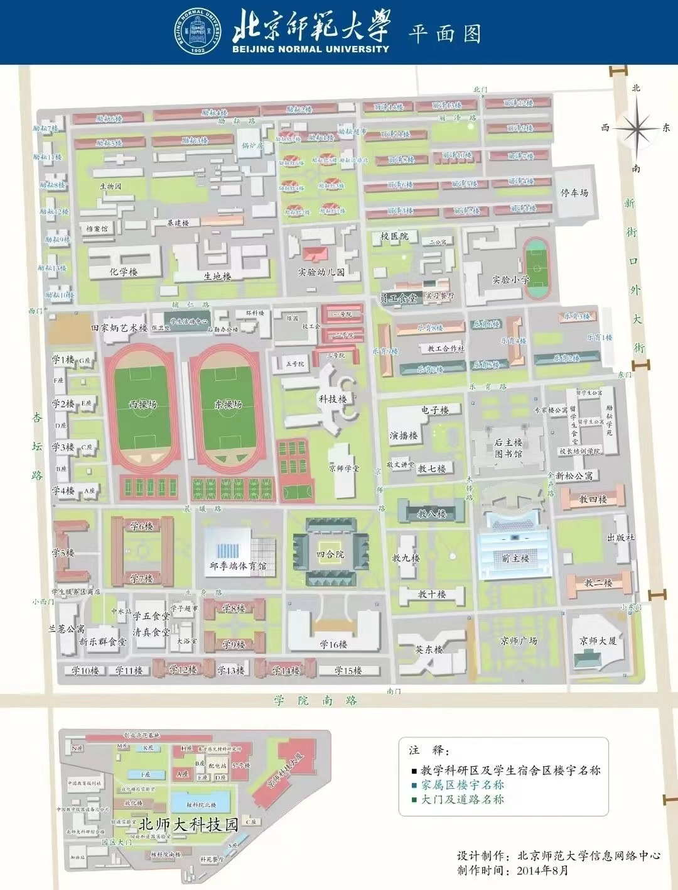

# 北京师范大学/北师大/师大

## 学校数据

### 学校排名

- 教育部直属、师范类、双一流、985、211
- 文科实力评级 A+，位列第三（软科2023年）

| 年份 | [国际排名（QS）][qs] | [国内排名（软科）][ranking] |
|:---: |:---:|:---:|
| 2024 | 272 | （尚未公布） |
| 2023 | 262 | 19 |
| 2022 | 270 | 17 |
| 2021 | 279 | 13 |
| 2020 | 277 | 14 |

[qs]: https://www.qschina.cn/universities/beijing-normal-university
[ranking]: https://www.shanghairanking.cn/institution/beijing-normal-university

### 专业情况

- *王牌专业*：教育学、心理学、汉语言文学、地理科学、历史学等。
- *双一流建设学科*：哲学、教育学、心理学、中国语言文学、外国语言文学、中国史、数学、地理学、系统科学、生态学、环境科学与工程、戏剧与影视学。
- *国家特色专业*：特殊教育、汉语言文学、数学与应用数学、物理学、历史学、心理学、天文学、国际经济与贸易、地理科学、体育教育、信息管理与信息系统、思想政治教育、环境科学、化学、英语、教育技术学、体育教育（师范）、化学（师范）。

### 2021年北京录取分数线

|                                 专业                                 | 分数  | 对应位次 |
| :------------------------------------------------------------------: | :---: | :------: |
|                                统计学                                |  663  |   1215   |
|                       汉语言文学、数学、心理学                       |  662  |   1292   |
|                    历史学、计算机科学与技术、PPE                     |  660  |   1421   |
|                                传播学                                |  659  |   1458   |
|       物理学、天文学、社会学、人工智能、工商管理、国际经济贸易       |  658  |   1557   |
| 金融学、资源环境科学、化学、哲学、法学、环境科学与工程类、生物科学类 |  657  |   1632   |
|                  会计学、金融科技、英语、公共管理类                  |  656  |   1729   |

## 以当时的分数选择本学校的原因

- 择校因素：分数合适、高考6选3为生化政（没选物理，因此理科专业较受限）、文科优势、师范类。
- 学校还是专业：综合考量。学校排名会影响之后发展机会、择业等；专业排名则会影响自己的学习体验、学到的东西多少、能力提升等，也会间接影响之后的择业。
- 同分数段其他学校多为理科优势学校（如[北航](./北京航空航天大学.md)、[北理](./北京理工大学.md)等），省外学校（如[武大](./武汉大学.md)、[南开](./南京大学.md)等）对于选考要求也较为苛刻。

## 学业

### 课程安排

- 大学课程分为：公共必修课（微积分、计算机、思政、英语、体育等）、公共选修课、专业必修课、专业选修课。
- 可以跨选其他专业的课。可以旁听。
- 选课为先到先得（拼运气）。

### 学习情况

- 学校教学整体偏扎实和基础
- **图书馆**开放时间 7:00–22:00（自习也可以去教室），可以提前一天预约，也可以当场直接选择座位。除了期中/期末等学习高峰期，一般座位比较富余。
- **保研**大致30%左右。励耘、强基等保研率更高。成绩包括90%的学业成绩（绩点）和10%的综测活动。除了依靠排名成绩保研外，还可以选择工作保研（2年）、支教保研、军事保研等。
- 学校配备学业辅导、心理热线、职业发展辅导等，同时可以找班主任、辅导员交流情况。

### 竞赛情况

- 学校主要竞赛为本基、大创、京师杯等。
- 竞赛对于个人来说可以提升履历、会有综测加分等。
- 课题研究可以找学校老师作为导师，需要自己邀请。

### 本科生导师制

- 北师大大部分专业为学生配备新生导师，新生导师主要是帮助同学们更好地适应大学的生活。后续和导师的交流需要看“缘分”。

### 社会实践·实习·小学期

- 学校大部分专业的毕业要求包括社会实践和实习，社会实践方面学校有很多自发/社团组织的支教和实践等，实习则更多需要靠自己。
- 小学期具体要看专业。大部分专业没有小学期。

### 转专业政策

- 转专业时间在大一、大二的下半学期。
- 大多数专业需要面试（部分专业需要笔试）。
- 录取率大致在60%–70%左右（专业与专业间差异较大。热门专业如汉语言文学等录取率会更低）。

## 生活

### 宿舍

- 宿舍一般是六人间，上下铺，私人空间比较小。
- 夏天因为开空调所以不会断电，但是冬天一般在晚上11:45左右断电，早上5–6点恢复供电；一般寝室晚上12点关门，晚回来需要按门铃打扰宿管阿姨。
- 每一层有1个水房（接水、洗漱、洗衣服）和1个卫生间，部分新盖的宿舍楼有层浴，但大多数宿舍楼没有层浴，需要去大澡堂洗澡。
- 大澡堂除高峰期（晚十点以后、军训期间）以外位置够用。
- 宿舍楼位置多分布在校园西侧生活区（校园东侧基本上是教学区：教学楼、图书馆、行政办公等），距离超市、食堂等地方比较近（毕竟学校没多大）。

<figure markdown="span">
  { style="max-width: 20em;" }
  <figcaption>平面图</figcaption>
</figure>

### 运动

- 以前有体育**打卡**，要求在各个体育场馆待够一定时间。但是今年（2023年）好像是系统坏了因此一直没有实行。
- 学校要求在八个学期中任选四个学期修够4学分**体育课**（一学期一学分），女生必修形体、男生必修健美。（会有奥运冠军的课哟）
- 学校会在每年下半学期举办一次体育**测试**，测试内容为身高、体重、肺活量、立定跳远、仰卧起坐/引体向上、50米、800/1000米。（新生在大一上要额外多进行一次）。
- **体育馆**：邱季端体育馆，里面主要是羽毛球场、排球馆和游泳馆。
- **羽毛球场**：可以预约，免费。一般是以院系为单位进行预约。
- **游泳馆**：可以预约，免费。
- **健身房**：学校健身房主要服务于体育课，学生日常想要健身需要去校外。
- **室外体育场**：小足球场、排球场、网球场等。
- **操场**：两个操场，西操场为假草，东操场为真草。在没有课的情况下，可以自行进去进行体育锻炼。
- **篮球场**：室外，无需预约。

### 饮食

- **食堂**：学校主要有三个大食堂。
  - 留学生食堂：在教学区，味道、价格都不算是非常好，但是离图书馆、教学楼比较近，所以去的人也不算少；
  - 学五食堂：在生活区，性价比很高，种类也非常多；
  - 新乐群食堂：在生活区，口味比较丰富，还有可以自助盛菜的“智慧食堂”。
  - 除此之外，在家属区还有教工食堂等（学生也可以吃）。
- **奶茶咖啡**：学校里有瑞幸咖啡、挪瓦咖啡、蜜雪冰城、书亦烧仙草等连锁店，同时各个食堂还都有很多卖饮料的地方。
- **小吃街**：小吃街里有水果店、面包店、肯德基、醉面、烧烤店、重庆小面、锡纸粉、卤肉饭、无名缘、饭团、烤肉饭、鱼粉、煎饼等，同时也会定期更新。
- **超市**：学校有物美超市和多个便利店，物美超市里面物品丰富，但可能比外面略贵；同时里面也有如冒菜、烤肉饭、凉皮、酸辣粉、煎饼、关东煮等。

### 学校活动

- 校级活动较为丰富，有校园歌手大赛、一二九合唱比赛、风云杯辩论赛、风云讲坛、未来教师素质大赛等大型活动，还有足球、篮球、乒乓球、排球等大型体育比赛。
- 院级活动以我所在的哲学学院为例，因为哲学学院不算大，因此活动主要以日常的经验交流会、各个院内体育比赛、参观实践为主，同时也有像新年晚会等大活动。

### 学生工作

- 校级工作部门包括校学生会（星火班）、校团委（社团工作部等），还有如白鸽志愿者协会等社团工作岗位。
- 院级工作部门主要包括学生会、团委和新闻中心（各院系不同），每个组织也下设很多部门（如学习部、文宣部、体育部、团务部等）。
- 关于学生工作参与：参与学生工作不能盲目，也不是参加的越多越好，理想的情况应该是结合自己的学习情况（比如所在院系课业负担、是否参加双学位学习、自己对学业的要求、自己对未来的规划等）以及自己的兴趣参与。每个部门在特定时段都会出现比较忙碌的状态，参与很多部门就容易出现冲突的情况。因此，如果想参与学生活动，最好通过公众号等形式了解好部门的情况，再根据自己情况进行斟酌选择。

### 社团

- 校级社团较为丰富，学校也有百团大战可以让学生们更好地了解并加入各个社团。
- 社团活动根据社团不同而不同，由于笔者并没有参加很多社团，因此在这里无法细说。但是，根据与同学的交谈，大部分社团活动都非常丰富，会组织同学们去北京的地方（滑冰、参访），也会有很多日常活动（如轮滑、舞蹈等）。因此，社团活动可以较好地满足日常休闲的需求。

### 民间自发组织

- 学校有北师小喇叭、北师小气球、北师小贴士等网络凭条，可以供学生们交流。
- 其他自发组织有待你们的发掘！

### 学校周边

- 娱乐：学校周边有枫蓝国际、西直门凯德茂等商场（但都需要骑车或者公交），同时牡丹园也有很多吃的。
- 交通：学校周边有很多公交车站，但是地铁站较远（走路大致需要15分钟）。地铁站包括北太平庄地铁站（学校北侧：19号线）和积水潭地铁站（学校南侧：2号线和19号线）。
- 离[北邮](./北京邮电大学.md)很近。

## By the way

- 男女比例3:7
- 由于是师范院校，因此教学整体来讲比较扎实。同时也有很多师范的特色活动，比如未来教室素质大赛（会请北京市高级、特级教师讲座，去年也请了RDFZ副校长和老师）、各个支教团和教育实践活动，因此对于想要成为老师的同学来说比较友好。
- 乌鸦作为学校的吉祥物，参与到了日常生活……来北师大有机会和乌鸦亲密接触。哟
- 可能学校最受诟病的地方就是地小人多，因此住宿等条件并不理想（尽管现在在逐渐翻修）。但是经历了一年之后，笔者也从一开始的排斥到现在逐渐适应，因此需要同学们做好心理准备，不要期待太大。
- 以上内容多为个人体验，不代表 100%的客观性和正确性。
- 由于大学和高中从学业、生活、活动等方面有较大的差别，因此欢迎私下联系询问交流。
