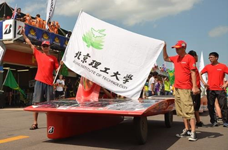
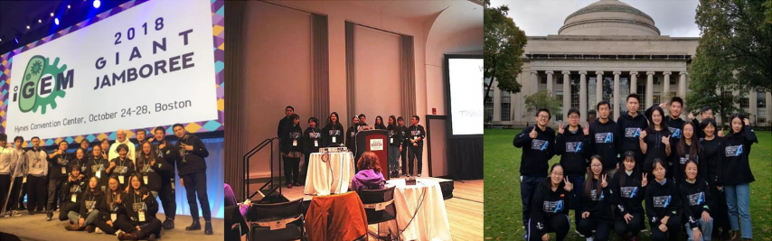
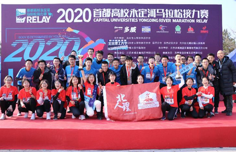
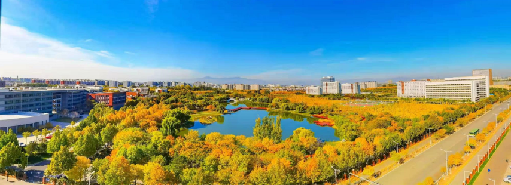
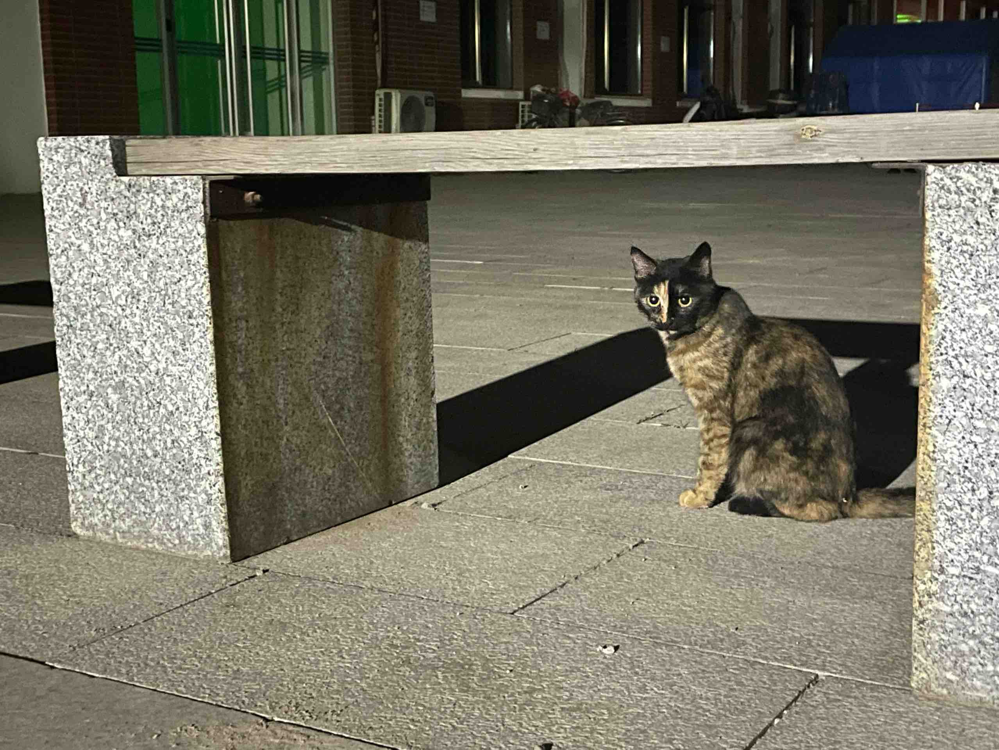

# 北京理工大学/北理/北理工

{{ still_migrating() }}

北京*理工*大学是一所有*军工特色*的*综合*性大学。

{{ b23_tv("BV1ua4y1E7uf") }}

## 学校数据

###  学校排名

| 年份 | 国际排名（QS） | 国内排名（软科） |
| ---- | -------------- | ---------------- |
| 2023 | 355            | 16               |
| 2022 | 373            | 18               |
| 2021 | 392            | 19               |
| 2020 | 436            | 20               |

### 专业情况

!!! tip "官方信息"

    请参考[2023年报考指南（电子折页）](https://miniprogram.51gzb.com/gzb/filp/bit2023/bkzn/index.html)。

以下括号内为报考时专业大类，冒号后为具体专业。

- ***军工相关***（**宇航与机电、智能制造与智能车辆**）：兵器科学与技术、装甲车辆工程、弹药工程与爆炸技术、探测制导与控制技术、……

  兵器科学与技术学科在第五轮学科评估中排名*前5%*，获得*A+*评级。若对此感兴趣，十分推荐。

  一方面因为北理实力雄厚，在此有传统优势，是中国共产党创办的第一所理工科大学、我国第一所国防工业院校，有“预警机之父”王小谟等校友，国庆70年时在高校中参与人数最多（4631人）。

  选这些专业可能会*影响出国深造*。

- ***工科技术类***（**宇航与机电、智能制造与智能车辆、电子信息、信息科学技术**）：自动化、车辆工程、通信工程、电子信息工程、计算机科学与技术、……

- ***理学类***（**理学与材料菁英**）

  录取后在求是书院学习深造，专业分流可以到书院对应的材料学院、化学与化工学院、生命学院、数学与统计学院、物理学院5个专业学院共计19个理科／工科专业，拥有冲击环境材料技术国防科技重点实验室、原子分子簇科学教育部重点实验室、生物医药分离分析北京市重点实验室、复杂信息数学表征分析与应用北京市重点实验室、先进光电量子结构设计与测量教育部重点实验室等重点实验室。是北理工少数具有发表 <i>Science</i> 和 <i>Nature</i> 文章能力的专业。

- ***文科类***（**管理**）

- 就 peer pressure 而言，徐特立书院强于睿信书院、精工书院，其他书院会再弱一些。

### 往年在北京录取分数

按大类招生，一般入学一年后再细分专业。

往年除“未来精工技术”“徐特立英才”外，均保专业大类。因此各专业大类分数很相近。

|       专业大类        | 2022年 | 2021年 |       2020年        |
| :-------------------: | :----: | :----: | :-----------------: |
|     未来精工技术      |  670   |  664   |     （未开设）      |
|      徐特立英才       |  665   |  659   |         665         |
|      宇航与机电       |  659   |  653   | 656（当时是提前批） |
|  智能制造与智能车辆   |  659   |  653   |         654         |
|     信息科学技术      |  659   |  653   |         653         |
|       电子信息        |  659   |  653   |         653         |
| 理学与材料/理科试验班 |  659   |  653   |         653         |
|          ……           |   …    |   …    |          …          |

!!! tip "官方信息"

    其它专业大类、年份的数据请参考[历年分数 - 北京理工大学招生信息网](https://admission.bit.edu.cn/static/front/bit/basic/html_web/lnfs.html)。

按照往年的录取情况来看，物理组在1900–2300名左右，不限组在2100–2300名左右。

中外合作办学这4个专业会根据专业志愿和高考分数来录取。如果选择调剂，会出现专业调剂的情况；如果选择不调剂，可能会滑档。

鲍曼学生在大一第一学期结束前，会有一次转专业的机会，可以鲍曼学院内部转专业。

## 以当时的分数选择本学校的原因

- 位于北京。
- 除了徐特立、未来精工技术，可以保专业，不会被调剂到不喜欢的地方。（连续多年如此）
- 985大学保研率较高。
- 国企央企对北理工认可度较高。（每年有数百位毕业生去航天科技和航天科工集团就业）

2023年6月22日祁志伟老师：“北理工对北京的考生给的政策是同一专业组的专业，**过线保第一志愿**（要注意徐特立学院和中外合作办学的线是不一样），总体都是提档不退，服不服从调剂这个影响不大。”（在学校的咨询群里说的）

## 学业

### 课程安排

- **课程**

  - 下图是[“电子信息实验班”2020级](https://ydx-2147483647.github.io/subs-articles/si-yuan-electronic-engineering/)的主干课程体系，大部分专业都是类似结构——公共基础课、专业必修课、专业选修课，以及体育课、公选课等。

    <figure markdown="span">
      
      <figcaption>主干课程体系｜2020级培养方案</figcaption>
    </figure>

  - *公共基础课*：微积分/工科数学分析/高等数学、线性代数、概率论与数理统计、工程制图、复变函数与数理方程、思想政治课等等。

  - *专业课*：不同专业差别很大，具体可以参考[分专业宣讲](https://mp.weixin.qq.com/s/dHySY5uXFklD8BEVAFoRYg)。

  - *体育课*：游泳、羽毛球、轮滑、八段锦……有些老师甚至是前全国冠军。

  - *公选课*：课程内容类似 RDFZ 的选修课，分通识（哲学与历史、文学与艺术、健康与社会、经济与管理、科学与技术、创新与创业）、实践（艺术、科技、文化）两种，个别通识课全英文上课。

- **[选课机制](https://bit101.cn/paper/10)**

  - *必修课（公共基础课、专业必修课）*：直接预置，无需选课。（这些课程会限定上课的学期，不像一些学校可自由调整。而且预置课程会限定老师。）
  - *选择性必修课、专业选修课、体育课*：分多轮，前两轮填平行志愿再统一随机抽签，之后先到先得。正式上课一周内，还可退换课（先到先得）。
  - *公选课*：同上，但志愿有顺序。
  - *专业课中的实验学时*：教师与各班自行安排。

- **评价机制**

  - *平均绩点*：按学分加权平均，不含综合测评。
  - *综合测评*：决定优秀学生奖学金级别（军工类专业三等奖为前 60%，其它为前 40%）。涉及成绩、实践创新（赛事参与、获奖、学术成果）、日常表现（学生工作、社会实践、文体活动、志愿服务），成绩占大头（80%左右），具体方式与书院相关。

### 学习情况

!!! note "校区"

    大部分专业前三年在良乡，四年级再去中关村。以下主要描述良乡。

- **学校整体学习氛围**

  问了几位同学，都觉得还挺好的。

- **[图书馆](https://lib.bit.edu.cn/)**

  - 三层，每层三四间阅览室。
  - 借阅书者少，自习者多。
  - 有很多人平常不去图书馆，因为网上也可找书，教室、咖啡厅、办公室等空间也可自习。
  - 进馆需预约（预约后一小时内进馆），此后可中途临时离开一小时。可预约座位，也可只预约借书。
  - 有志愿组织“微尘”帮助维护借还书业务。

- **学业辅导**

  一些书院、学院有学业指导中心（学生组织），维护答疑群，开设期末串讲、一对一答疑。例如[大物近代物理串讲 - 哔哩哔哩](https://www.bilibili.com/video/BV1VW4y1T77y/)。

  大多只针对一二年级的公共基础课。

- **保研情况**

  比较正常，不是特别难，也不是特别宽松。各专业纯成绩保研（学名“综合测评成绩免试推荐”）率大概在25%，除此之外还有竞赛保研，保留研究生资格（当两年辅导员之后参加研究生学习，也有个别其它岗位），支教保研，工程硕士（与企业联合培养）等保研方式，总计保研率在30%到40%，和具体学院有关。

### 竞赛情况

- 屠龙勇士，Arduino 机器人。

- 电子设计竞赛

- 数学建模

- 微积分/数学竞赛

- 大学生英语竞赛

- 赛车赛事：中国大学生方程式系列、亚洲节能车马拉松等等。

  <figure markdown="span">
    
    <figcaption>学校各类赛车队多次夺得全国总冠军，并代表中国出征世界大赛</figcaption>
  </figure>

- 国际基因工程机器大赛（iGEM）

  <figure markdown="span">
    
    <figcaption>生物专业学生赴麻省理工参加 iGEM，连续6届获得金牌</figcaption>
  </figure>

- 互联网+

- 挑战杯

- 大部分竞赛属于团队比赛，需要在专业或学校范围内组队参加。

### 本科生导师制

- 每个行政班都有学育、朋辈、德育导师，另外学校还会设立学术、通识、校外导师。
- 具体情况因人而异。

### 社会实践·实习·小学期

- 有小学期，在正常学期开始前或结束后，具体因年级、专业而异。相当于一门课程，成绩与正常学期一并计算平均绩点。
- 高年级（主要是信息科学专业）会组织参观理工雷科、快手、华为、字节跳动、中电十五所、阿里巴巴等企业，每次大概10–30人。寒暑假前辅导员也会转发实习机会，但似乎不是专门合作单位。

### 转专业政策

- 转出无限制，转入有要求，具体取决于接收学院，可参考[教务部转专业的通知（2023年5月）](https://jwb.bit.edu.cn/tzgg/57c093bd381940efa923240476184538.htm)。
- 除强基计划、中外合作办学的特定专业外，其他所有专业都在大一结束后可以申请。每学期末均可申请，一共有6次。
- 入学时转专业较宽松。此后转专业需要和转入、转出学院谈，事实上要求成绩较高（~5% 左右）。书院每次公示时，每书院大约转入5–20人。

## 生活

!!! note "校区"

    以前（2020级及以前）大部分专业前三年在良乡，四年级再去中关村；现在年级不太确定。以下主要描述良乡。中关村宿舍楼条件会相对差一些，宿舍面积较良乡小一些。

### [宿舍](https://bit101.cn/paper/4)

宿舍有[很多](https://bit101.cn/paper/4)，不尽相同。

- 一般四人一间，个别六人一间。
- 事实上不断电。
- 大致 0:00–6:00 封寝，有事可提前联系宿舍管理员开门。
- 每层有能饮用的开水。部分设备需刷校园卡，不过学校会定期发放用水补贴。
- 每层有浴室，有隔间，浴室16点之后提供热水供应。

### 运动

- 良乡校区体育馆
  - 有游泳馆、篮球场、羽毛球场、健身房。
  - 体育课时免费，付钱只是买优先权。周末比较贵，所以一般大家不太付钱。
- 室外
  - 良乡各区域不太一样，网球场、篮球场、排球场、田径场+足球场、专门足球场等。
- 中关村校区体育馆
  - 有羽毛球场和健身房。

### 饮食

- 食堂：
  - 良乡有三个食堂，各三层。
  - 正餐：比较好吃，比外面便宜。北食堂二层面很好吃，还便宜。
  - 夜宵：东食堂烧烤很有水平，北食堂炒菜不错。
  - 补贴：每学期￥360直接打到饭卡里。
- 奶茶咖啡：和外卖差不多。教学楼内有一家，部分书院社区有学生制作的咖啡，另外教学内还有校友创业的自助咖啡机；三个食堂也都有茶饮店（北食堂的每月20日加￥2任选）。
- 超市：大部分宿舍楼附近有超市。日用品价格略高，但比北京物价水平低。有些超市会买汉堡、煎饼等。

### 学生组织、社团等

北京理工大学和一般大学一样，有许多学生组织、社团。二者界限不明显，硬性区别是学生组织有学校支持的经费，而社团会收社费（大概一年￥5）。

与 RDFZ 相比，北京理工大学略严肃、保守一些，例如小组织没有自己的微信公众号，只能由[学生会等官方](https://www.bit.edu.cn/wszrq/xyxmt/index.htm)代发。

科创、文体、志愿服务等组织的详细列表可参考[每年招新外场预告](https://mp.weixin.qq.com/s/aIysPYrcdbwa0cLtEd24sg)。

- **学生组织**

  - 学校、书院、共青团相关。这些组织有的紧张，有的松散，不同书院的学生会氛围都不太一样。参与这些组织，会自然认识一些高年级同学，对大学生活有帮助。
  - 科创：[网络开拓者协会](https://www.bitnp.net/)（电脑义诊、知识讲座、维护[镜像站](https://mirrors.bit.edu.cn/)等）、机器人队（竞赛）、校科协（竞赛筹办）、……
  - 志愿服务：微尘志愿者协会（图书馆还书、整理业务，支教）、……（目前还没有 RDFZ 志愿团那样统一的组织）
  - 文体：话剧团、舞团、足协、……
  - 新媒体：[北理之声](https://www.ximalaya.com/zhubo/4017973)（广播站）、记者团、……

- **注册社团**

  - NSC：网安俱乐部，组织 CTF（catch the flag）比赛教学，有自己的 [CTF 平台](https://github.com/BIT-NSC/CTFd-owl)。

  - 骑行社：假期会组织骑行海南。

  - 青藤田径社：曾在全国高校百英里接力赛中获得冠军；永定河马拉松接力赛中获得男子、女子组亚军，仅次于清华。

    <figure markdown='span'>
      
      <figcaption>2020首都高校永定河马拉松接力赛</figcaption>
    </figure>

- **其它组织**（松散而有一定结构的人的集合）

  - 贝塔驿站（树洞、[学习资料](https://b.xiumi.us/board/v5/542xr/296020491)等，规模比较大）
  - 游戏群（大的游戏都有好几百人）、老乡群（只有一部分人参加）、竞赛群、……
  - 跳蚤市场（有专门同学维护）
  - 关怀流浪猫狗交流（偶尔会遇到救助需求，不像北大猫协那样正式）

### 学校周边

- 微分性质
  - 附近一两千米有时代广场、天街、首创奥莱，覆盖商场、饭馆、影院等。
  - 校内富集共享单车（哈啰），大概每月 ￥20。骑共享单车十几分钟可到以上任意地方。
- 拓扑性质
  - 距离地铁站（良乡大学城、良乡大学城北）约 1/√2 站地，可骑车几分钟到，或等每15分钟一趟的免费摆渡车。
  - 学校有到中关村的双向班车，约一小时可达。频次按需求增减，大约每小时一趟。

## 附言

- 就业情况可参考[信息公开网的《2022年北京理工大学毕业生就业质量年度报告》](https://xxgk.bit.edu.cn/jxzlxx/bysjyzlndbg/e8607cc612884ffc82d48bbef55b5648.htm)。

- 学校有湖。人与自然真的和谐统一，过桥有游鱼，午夜有刺猬、松鼠，偶尔还有流浪的家养小型哺乳动物。

  <figure markdown='span'>
    
    <figcaption>北湖</figcaption>
  </figure>
  <figure markdown='span'>
    

      
      
      <!-- swan与goose的区别：https://zhihu.com/question/37644767/answer/3283547401 -->
    

    <figcaption>猫·鹅</figcaption>
  </figure>
  <figure markdown='span'>
    
    <figcaption markdown='span'>[“北理工星”命名仪式在北湖南岸举行](https://www.bit.edu.cn/xww/zhxw/yljs/6a0bd6a2f3be4532bcc36b3b195df2f5.htm)</figcaption>
  </figure>

- 附近有良乡大学城公园。

- 假期一般较长。例如五一劳动节例行运动会，不参赛的同学放7天假{{ just_kidding("，然后回来就考试") }}。

- 良乡虽然在郊区，但也是卫星城，并不缺什么设施，物价还比市区稍微低一些。只是见同学成本比较大。

- 徐特立书院等保研率高，但考试难度一般会比正常偏高，挂科太多很可能需要转去其它书院。

- 可考虑关注微信公众号“北京理工大学招生办公室”和“京工黄庄人”（`BIT_RDFZers`）。
